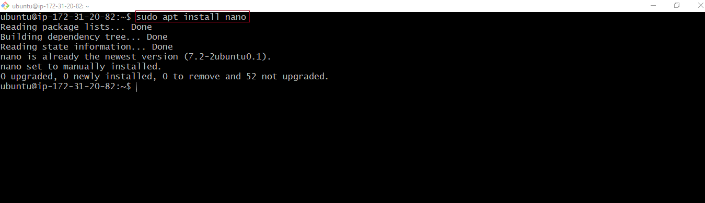

# LINUX TEXT EDITOR
#
# VIM TEXT EDITOR
The Linux Vim text editor, short for “Vi Improved”, is a powerful and versatile text editing tool deeply ingrained in the Unix and Linux ecosystems. Vim builds upon the foundation of the original Vi editor, offering an extensive set of features, modes, and commands that empower users to manipulate text efficiently. While Vim has a steeper learning curve compared to simpler editors like Nano, its capabilities make it a favourite among tech professionals and anyone working extensively with text files.
#
## VIM INSTALLATION

### 1. Update the package list
```
sudo apt update
```


#

### 2. Install Vim
```
sudo apt install vim
```
This will install the latest stable version available in Ubuntu's official repositories.


#

### 3. Verify the installation

```
vim --version
```
If it outputs version information, Vim is successfully installed.


#

## WORKING WITH VIM EDITOR

### Open a new file named `exercise.txt` using the following command:
```
Vim exercise.txt
```


#

### ** Enter Insert Mode to edit the file.
* Press `i` to enter insert mode.
* Type the following text into the file:
```
Hello, this is a Vim hands-on project.
Welcome to darey.io
```


#

### ** Moving Around: Navigate through the text using the arrow keys or h (left), j (down), k (up), and l (right).

### ** Deleting a Character: Press `esc` on your keyboard to exit the `insert mode`. Position the cursor on a character you want to delete and press x.

### ** Deleting a Line: To delete an entire line in the file, ensure that you are not in the `insert mode`. If are in the insert mode, simply press the `esc` key as above. Then, place the cursor on a line, and press d twice on your keyboard to delete the entire line.

### ** Undergoing Changes: Make a change (add or delete text) in Insert or Normal Mode, then press Esc to enter Normal Mode and press u to undo the last change.

### ** Saving Changes: After you have finished writing into the file, press `esc`, then type `:wq` and press `Enter`. This will save the file. `w` means `write` and `q` means `quit which basically quits the vim mode and returns back to the terminal.
### ** Quitting Without Saving: In case you do not intend to save the file, simply press `esc`, then type `:q!` and press Enter to quit without saving changes.


#

# Nano Text Editor
Among Linux text editors, Nano stands out as a user-friendly and straightforward tool, making it an excellent choice for users who are new to the command line or those who prefer a more intuitive editing experience. Nano serves as a versatile and lightweight text editor, ideal for performing quick edits, writing scripts, or making configuration changes directly for the command line. Its intuitive command set simplifies text manipulation tasks, allowing users to navigate through files, insert or delete text, and save changes effortlessly. Nano’s ease of use extends to its keyboard shortcuts, making it accessible even to those unfamiliar with intricate with command sequences.

## NANO INSTALLATION

### 1. Update the package list
```
sudo apt update
```

#

### 2. Install Nano
```
sudo apt install nano
```
Nano is usually pre-installed on Ubuntu, but this command ensures you have it or installs it if it's missing.


#

### 3. Verify the installation
```
nano --version
```
This will show the version number if Nano is installed correctly.


#

## Working with Nano Editor
### ** Opening a File: named “nano_project.txt” using the following command:
```
nano nano_project.txt
```
You will enter the Nano editor interface.


### ** Entering and Editing text: Type a few lines of text into the file. Nano has a simple interface, and you can start typing immediately.

### ** Saving Changes: Save your changes by pressing `Ctrl` + `o`. Nano will prompt you to confirm the filename: press `Enter` to confirm.

### ** Exiting Nano: If you wish to exit nano without saving the file, simply press `Ctrl` + `x`. If you have unsaved changes, Nano will prompt you to save before exiting.

### ** Opening an Existing File: Open an existing file (if available) using the following command:
```
nano nano_project.txt
```
Navigate through the file using arrow keys. Write data, then save the file content.

